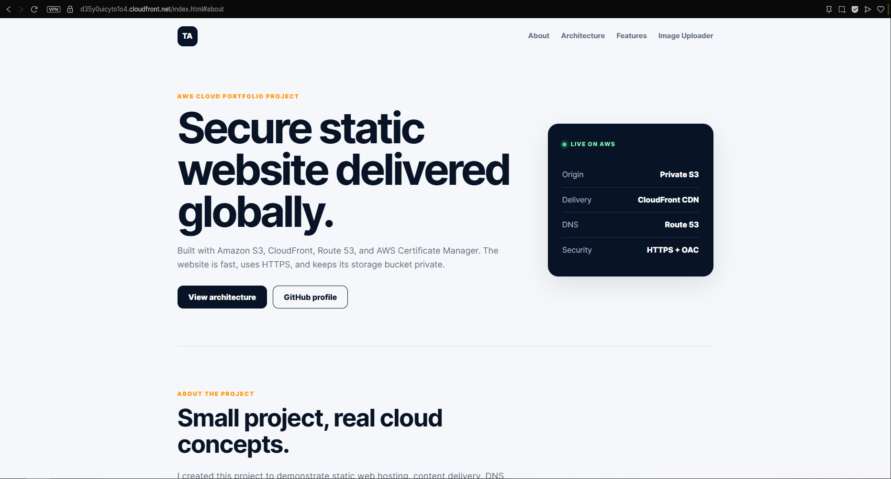
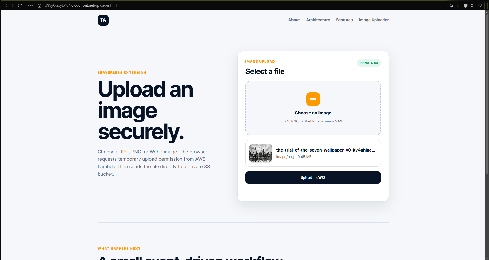
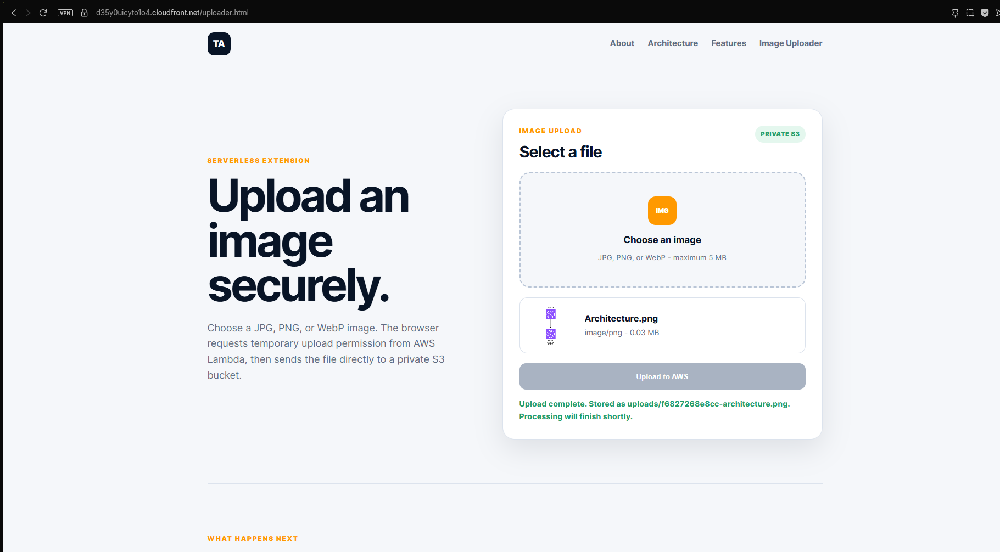
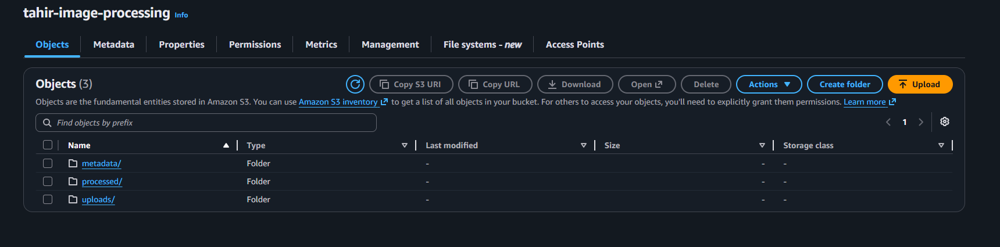
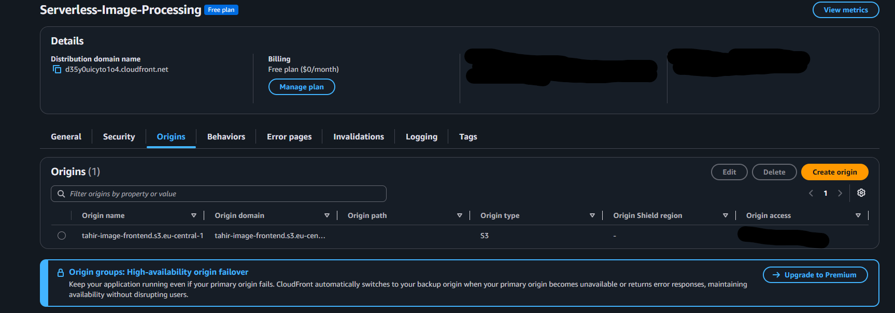
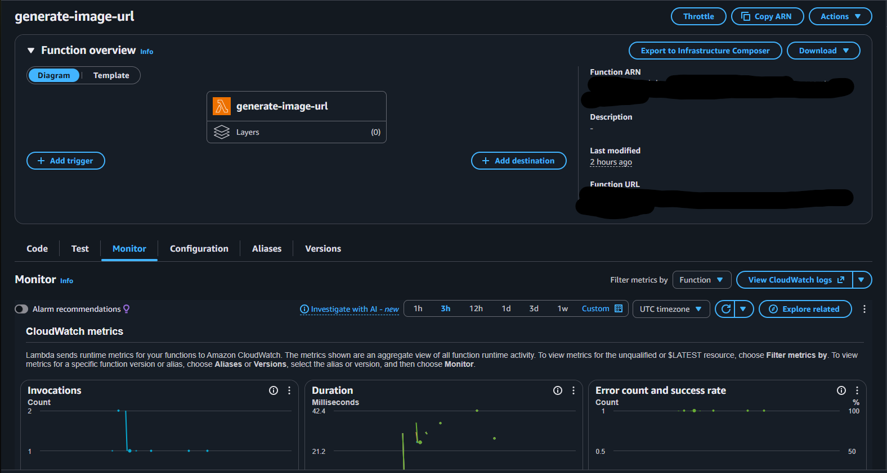
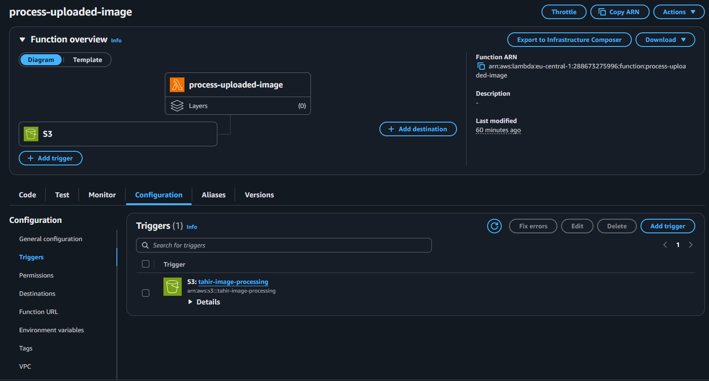
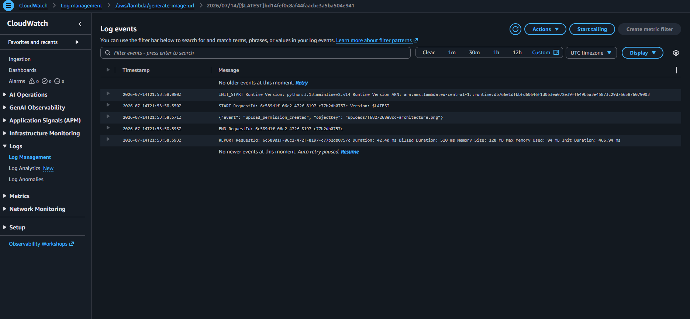
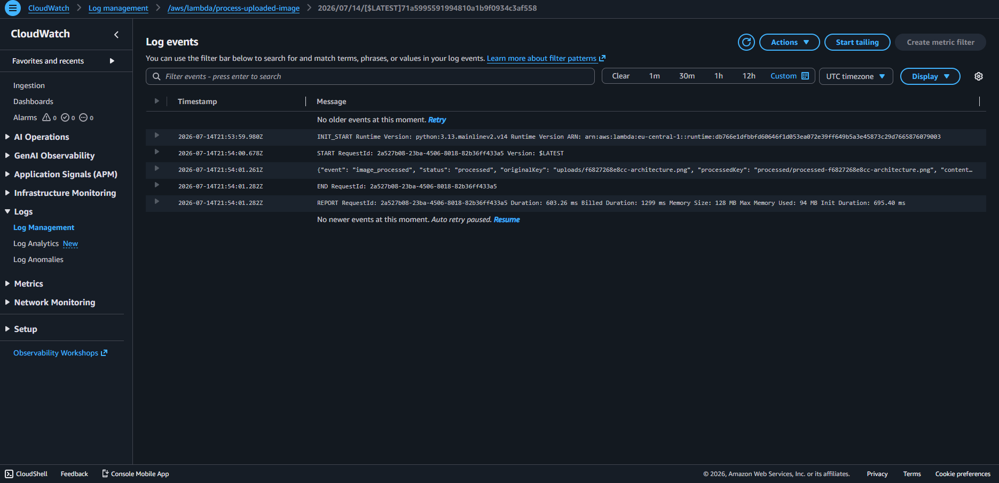

# AWS Serverless Image Uploader

This project is an updated version of my previous AWS S3 static website project.

In the original project, I created a static website using HTML, CSS and JavaScript, stored the website files in a private Amazon S3 bucket and delivered the website through Amazon CloudFront.

For this project, I kept the same website design and content instead of creating a completely new frontend. I extended the existing website by adding a serverless image-upload feature using AWS Lambda, a second private S3 bucket, IAM policies, S3 events and Amazon CloudWatch.

## Live Website

- Website: https://d35y0uicyto1o4.cloudfront.net/
- Image uploader: https://d35y0uicyto1o4.cloudfront.net/uploader.html

The live AWS resources will be disabled outside demonstration periods to avoid unnecessary usage and costs to me.

## Project Goal

The goal of this project was to take my previous static website and add a real backend feature to it.

The updated website allows a visitor to:

- Select a JPG, PNG or WebP image
- Preview the selected image
- Upload an image of up to 5 MB
- Upload directly into a private Amazon S3 bucket
- Automatically start a processing workflow
- Create an organized processed copy
- Create a JSON metadata receipt
- View a clear success or error message

This project demonstrates how a static frontend can communicate with serverless AWS services without running a traditional web server.

## Architecture

The application uses two separate S3 buckets.

The first bucket stores the frontend website files. It remains private and CloudFront retrieves the files through Origin Access Control.

The second bucket stores uploaded images and processing results. It is also private and is divided into three object prefixes:

- `uploads/` contains the original browser uploads
- `processed/` contains copies created by the processor Lambda
- `metadata/` contains JSON processing receipts

## How the Application Works

### 1. Website delivery

The visitor opens the website using the CloudFront domain.

CloudFront retrieves the HTML, CSS and JavaScript files from the private frontend S3 bucket. The user does not access the frontend bucket directly.

### 2. Image selection

The visitor opens the Image Uploader page and selects an image.

The frontend JavaScript checks the declared file type and file size before allowing the upload. The uploader accepts JPG, PNG and WebP images with a maximum size of 5 MB.

A preview of the selected image is displayed in the browser.

### 3. Temporary upload permission

The browser sends the filename and declared content type to a Lambda Function URL.

The first Python Lambda function validates the request and creates a short-lived presigned S3 upload form.

The permission expires after two minutes, which means the browser does not receive permanent access to the S3 bucket.

### 4. Direct S3 upload

The Lambda function returns the temporary upload information to the browser.

The browser then uploads the image directly to the private image bucket under the `uploads/` prefix.

The image does not pass through the Lambda function. This keeps the backend simple and avoids using Lambda to transfer the complete image file.

### 5. Automatic processing

When a new object appears under `uploads/`, Amazon S3 creates an `ObjectCreated` event.

That event invokes the second Python Lambda function automatically.

The processor Lambda reads information about the uploaded image, creates an organized copy under `processed/` and generates a JSON receipt under `metadata/`.

### 6. Logging

Both Lambda functions send execution information to Amazon CloudWatch.

These logs make it possible to verify that temporary upload permission was created and that the uploaded image was processed successfully.

## AWS Services Used

| Service | Purpose |
| --- | --- |
| Amazon S3 | Stores the private frontend files, uploaded images, processed copies and metadata |
| Amazon CloudFront | Delivers the website globally over HTTPS |
| AWS Lambda | Creates temporary upload permission and processes new S3 objects |
| Lambda Function URL | Gives the frontend an HTTPS endpoint without requiring API Gateway |
| AWS IAM | Controls which S3 actions each Lambda function is permitted to perform |
| Amazon CloudWatch | Stores Lambda execution logs and processing evidence |
| S3 Event Notifications | Automatically invokes the processor when a new image is uploaded |

## Frontend

The frontend was built with HTML, CSS and JavaScript.

It is based on my previous S3 static website project. I preserved the original homepage design, styling and content, then added an Image Uploader link and a matching uploader page.

### HTML

The HTML files provide:

- The original homepage
- The image-upload interface
- The image-selection input
- The preview section
- The upload button
- The upload-status message
- A custom error page

### CSS

The original website styles were preserved.

A separate uploader stylesheet was added so the upload interface matches the visual design of the previous website without replacing or unnecessarily rewriting the existing CSS.

### JavaScript

The uploader JavaScript is responsible for:

- Reading the selected image
- Checking the declared image type
- Checking the image size
- Displaying the local image preview
- Requesting temporary upload permission
- Building the S3 upload form
- Sending the image directly to S3
- Displaying progress, success and error messages

No AWS access keys are stored in the frontend.

## Python Lambda Functions

The backend contains two Python Lambda functions.

### Upload-permission function

The first function is named `generate-image-upload-url`.

Its responsibilities include:

- Receiving requests from the website
- Reading the filename and declared content type
- Checking that the extension and declared type are allowed
- Normalizing the filename
- Creating a unique object key
- Limiting uploads to 5 MB
- Creating a presigned S3 form
- Returning the temporary upload information to the browser

The S3 client uses the `eu-central-1` regional endpoint because the Lambda functions and image bucket are located in the Frankfurt region.

### Processor function

The second function is named `process-uploaded-image`.

Its responsibilities include:

- Receiving S3 `ObjectCreated` events
- Checking that the object came from `uploads/`
- Reading the object’s content type and size
- Creating a normalized copy under `processed/`
- Adding processing metadata to the copied object
- Creating a JSON receipt under `metadata/`
- Recording the completed operation in CloudWatch

The current project performs simple processing and organization. It does not resize the image or generate a real thumbnail.

Real thumbnail generation could be added later using an image-processing dependency such as Pillow and a Lambda layer or deployment package.

## IAM Policies

Each Lambda function uses a separate IAM execution role.

The permissions were restricted according to what each function needs.

### Upload Lambda permissions

The upload-permission Lambda is allowed to authorize object uploads only under:

`uploads/*`

It does not receive permission to read the bucket, delete objects or write to the processed and metadata prefixes.

### Processor Lambda permissions

The processor Lambda is allowed to:

- Read objects under `uploads/*`
- Write objects under `processed/*`
- Write JSON receipts under `metadata/*`

It does not use full S3 administrator access.

The JSON policy templates are included in the `policies` folder so the permissions can be reviewed separately from the application code.

## CORS Configuration

The website, Lambda Function URL and image bucket use different internet origins. Cross-Origin Resource Sharing was therefore required.

During local testing, the configuration allowed requests from:

`http://localhost:8000`

After deployment, the allowed origin was changed to the CloudFront website address.

CORS was configured in two places:

- The Lambda Function URL allows the website to request temporary upload permission
- The private image bucket allows the website to submit the presigned S3 upload

The final configuration should allow the CloudFront origin rather than allowing every website on the internet.

## Security Decisions

The following security controls were used:

- Both S3 buckets remain private
- S3 Block Public Access remains enabled
- CloudFront uses Origin Access Control
- The browser never receives AWS access keys
- Upload permission expires after two minutes
- Upload size is limited to 5 MB
- Only JPG, PNG and WebP declarations are accepted
- Object names are normalized before storage
- Each Lambda function has a separate IAM role
- IAM permissions are limited to the required S3 prefixes
- The processor trigger watches only `uploads/`
- Processed objects do not repeatedly invoke the processor
- The website is delivered over HTTPS

The project validates the file extension and browser-provided content type. A production application should also inspect the actual file contents, add authentication and implement rate limiting.

## Why I Used a Lambda Function URL

This application only needs one small public backend operation: requesting temporary upload permission.

A Lambda Function URL was sufficient for this requirement and kept the architecture easier to understand.

API Gateway was not used because the project does not currently require multiple API routes, request stages, API keys or more advanced API management.

## Why the Image Upload Goes Directly to S3

Sending the complete image through Lambda would make Lambda responsible for receiving and transferring the entire file.

Instead, Lambda creates temporary permission and the browser sends the image directly to S3.

This approach:

- Reduces Lambda work
- Keeps the function small
- Separates permission generation from file storage
- Avoids placing AWS credentials in the browser
- Demonstrates how presigned S3 uploads work

## Repository Structure

- `frontend/` contains the HTML, CSS and JavaScript files
- `lambda/` contains both Python Lambda functions
- `policies/` contains the IAM policy templates and S3 CORS configuration
- `docs/` contains the architecture diagram and project documentation
- `screenshots/` contains deployment evidence
- `.gitignore` prevents unnecessary local files from being committed
- `README.md` documents the complete project

## Deployment Evidence

### Updated Static Website

This is the CloudFront-hosted version of my previous static website with the new Image Uploader navigation link.

### Image Preview

The uploader displays the selected image, filename and file size before the upload begins.

### Successful Upload

The website confirms that the image was stored under the `uploads/` prefix and that processing will begin.

### S3 Processing Results

The image bucket contains separate prefixes for uploads, processed copies and JSON metadata receipts.

### CloudFront Distribution

CloudFront delivers the frontend from a private S3 origin.

### Upload Lambda

The upload-permission Lambda provides the Function URL used by the frontend.

### Processor Trigger

The processor Lambda is connected to the image bucket through an S3 event trigger filtered to `uploads/`.

### CloudWatch Processing Log

CloudWatch confirms that the processor handled the original object and created the processed result.

## Problems I Solved

### Region mismatch

The image bucket was initially created in `eu-central-1`, while the first Lambda function was created in `us-east-1`.

The resources were placed in the same region, and the Python S3 client was configured to use the correct regional endpoint.

### Failed to fetch

The uploader initially displayed `Failed to fetch`.

The problem involved the regional S3 endpoint and browser CORS configuration. I tested the Lambda Function URL separately, corrected the S3 endpoint and allowed the correct local and CloudFront origins.

### CloudFront AccessDenied

The first CloudFront request returned an S3 `AccessDenied` response.

I corrected the default root object, Origin Access Control and frontend bucket policy so CloudFront could retrieve the private website files.

### CORS after CloudFront deployment

The uploader worked locally but failed after being opened through CloudFront.

The browser origin had changed from localhost to the CloudFront domain. I updated both the Lambda Function URL CORS settings and image-bucket CORS configuration to allow the deployed website.

## What I Learned

This project helped me practise:

- Extending an existing cloud project
- Connecting a static frontend to serverless services
- Writing Python for AWS Lambda
- Using Boto3 with Amazon S3
- Generating presigned S3 uploads
- Configuring regional AWS endpoints
- Creating least-privilege IAM policies
- Using S3 event notifications
- Organizing objects with S3 prefixes
- Configuring CORS for local and deployed websites
- Protecting an S3 origin with CloudFront OAC
- Troubleshooting CloudFront, Lambda and S3 errors
- Reviewing Lambda activity in CloudWatch
- Documenting an AWS project for GitHub

## Future Improvements

Possible future improvements include:

- Generate real thumbnails using Pillow
- Add user authentication with Amazon Cognito
- Add a private image gallery
- Add presigned image-download links
- Inspect actual file contents instead of trusting only the declared type
- Add rate limiting
- Add automated tests
- Add CI/CD deployment
- Define the AWS resources using Terraform, AWS SAM or CloudFormation

## Cost Considerations

No Route 53 domain was registered for this project.

The website uses the default CloudFront domain to avoid domain-registration costs. The project uses small amounts of S3 storage, Lambda execution time, CloudFront delivery and CloudWatch logging.

AWS resources should be monitored and disabled or removed when they are no longer required.
